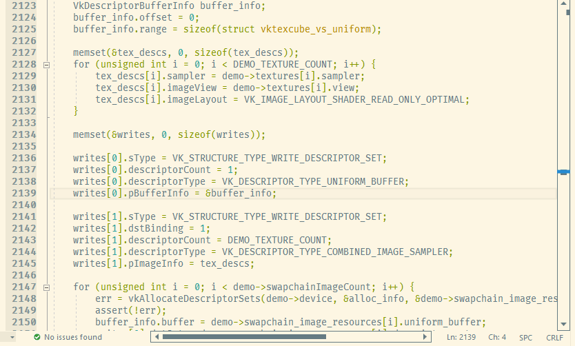

PeasyMotion
===
[](https://ci.appveyor.com/project/msomeone/peasymotion/branch/master)



Implements "word-motion" mode ~same way as it is done in vim-easymotion.
This extension differs from other motion/jump extensions as it assigns jump labels to all words in text viewport, without asking specific "jump" key.
Such a behaviour may lead to faster motion and navigation in certain scenarios.
Inspired by original [vim-easymotion](https://github.com/easymotion/vim-easymotion) script for VIM.

Download this extension from the [VS Gallery](https://marketplace.visualstudio.com/items?itemName=maksim-vorobiev.PeasyMotion)
or get the [CI build](http://vsixgallery.com/extension/PeasyMotion.a87d2837-6b54-4518-b014-3b29b4dcd902/).

## Key binding & options (for VsVim or ViEmu see 'Compatibility with other plugins' section)
Assign key combination through Tools->Options->Keyboard ( command name: Tools.InvokePeasyMotion )
Two jump label assignment algorithms are available (Tools->Options->PeasyMotion options):
* Caret relative - place labels based on proximity to caret (closer to caret -> shorter the label).
* Viewport relative - labels assigned from top to bottom of visible text in viewport.

In caret relative mode you can adjust 'proximity' sensitivity  via "Caret position sensitivity " option.
When caret sensitivity  is not equal to 0, caret position is quantized into blocks of (sensitivity +1) caret positions and is treated as being located in the middle of encasing block.

One can configure jump label colors, with live preview also. Color options for 'First motion' and 'Final motion' jump labels are available.
Just invoke PeasyMotion and goto **Tools**->**Options** and adjust style with live preview.
When 'Color source' options is not equal to **PeasyMotionJumpLabel****Motion**, one can sync label color style to other classification items from **Tools**->**Options**->**Fonts And Colors**->**Text Editor**.
When 'Color source' is equal to PeasyMotionJumpLabel****Motion one can configure classification style manually trough **Tools**->**Options**->**PeasyMotion** or **Tools**->**Options**->**Fonts And Colors**->**Text Editor**->**'PeasyMotion **** Motion Jump label color'**.

## Compatibility with other plugins
VsVim 
just bind PeasyMotion command in your .vimrc (or .vsvimrc) file:
```vimscript
nmap ;; gS:vsc Tools.InvokePeasyMotion<CR>
"VsVim is disabled until PeasyMotion finishes, so no 'i' is needed
```

ViEmu
just bind PeasyMotion command in your _viemurc file:
```vimscript
nmap ;; gS:vsc Tools.InvokePeasyMotion<CR>i 
"'i' is needed to enter into input mode.
```

## Bugreports, Feature requests and contributions
PeasyMotion can be developed using Visual Studio 2017 or 2019. Contributions are welcomed.
Check out the [contribution guidelines](CONTRIBUTING.md)

## License
All code in this project is covered under the MIT license a copy of which 
is available in the same directory under the name LICENSE.txt.

## Latest Builds
The build representing the latest source code can be downloaded from the
[Open Vsix Gallery](http://vsixgallery.com/extension/PeasyMotion.a87d2837-6b54-4518-b014-3b29b4dcd902/).

## Buidling
For cloning and building this project yourself, make sure
to install the
[Extensibility Essentials](https://marketplace.visualstudio.com/items?itemName=MadsKristensen.ExtensibilityEssentials)
extension for Visual Studio which enables some features
used by this project.
You may also want to check awesome [Mads Kristensen guide](https://devblogs.microsoft.com/visualstudio/getting-started-writing-visual-studio-extensions/) 
